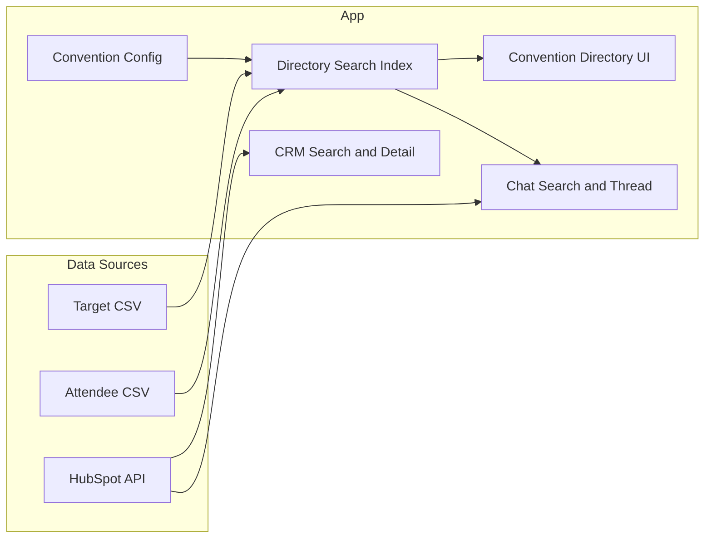

# Trade Show Prospecting App — Full Plan

## UI reference (Lovable screenshots)

The target interface is defined by your six Lovable screens:

| Screen               | Purpose |
| -------------------- | ------- |
| Conventions list     | "Conventions" title, subtitle "Browse upcoming events and their contacts", scrollable cards with 2-letter badge, name, dates, location, attendee count, chevron. Bottom nav: Conventions, CRM, Chat. |
| Convention directory | Back to Conventions; convention name + dates + location; search "Search name, company, or location..."; sections **EXHIBITORS** and **ATTENDEES** with contact cards (avatar, name, title · company, fit badge A/B/C, arrow). Bottom nav same. |
| CRM contact detail   | Avatar + name + title; card with Company, Location, Email, Phone, Website, Platform, Revenue, ICP Rating (fit); NOTES card; INDUSTRY card. "Check directory" when no HubSpot record. CRM tab active. |
| Chat home            | "Chat", "Search a contact to start a conversation"; search bar; **RECENT CONVERSATIONS** (avatar, name, last message snippet, date). Bottom nav, Chat active. |
| Chat search          | Same header; search bar (e.g. "angela"); section **CRM CONTACTS** (or combined Directory + CRM) with result cards; select one to open conversation. |
| Chat conversation    | Back, avatar, contact name, company; user/AI bubbles; input "Ask about this contact...", send. Chat tab active. |

Fit score from CSV only: display as badge (A/B/C or numeric from [WorldOfConcrete_Final_Scored_v2.csv](data/reference/WoC/WorldOfConcrete_Final_Scored_v2.csv) Score column). Map numeric (e.g. 95, 85, 80) to A/B/C if desired; otherwise show as-is. N/A when CSV has no score (e.g. attendee-only rows).

---

## HubSpot implementation reference (Phase 0 complete)

**Use [docs/hubspot_api_context.md](docs/hubspot_api_context.md) for all HubSpot integration.** It is the single source of truth for endpoints, request bodies, and fields.

Summary for implementers:

| Need | Endpoint / approach |
|------|----------------------|
| Search by company name | `POST /crm/v3/objects/companies/search` — filter `name` with `CONTAINS_TOKEN` and `value: "*<query>*"` for partial; `EQ` for exact. Request `properties`: name, domain, website, industry, annualrevenue, lifecyclestage. |
| Search by contact name | `POST /crm/v3/objects/contacts/search` — two filter groups (firstname CONTAINS_TOKEN, lastname CONTAINS_TOKEN) for OR behavior. Request `properties`: firstname, lastname, email, jobtitle, phone, company. |
| Look up company by domain | Same companies search with filter `domain` `EQ` and normalized domain; `limit: 1`. |
| Contacts at a company | `GET /crm/v4/objects/companies/{companyId}/associations/contacts` then `GET /crm/v3/objects/contacts/{contactId}?properties=...` for details. |
| Engagements for contact (TL;DR) | `GET /crm/v4/objects/contacts/{contactId}/associations/{type}` for calls, emails, meetings, notes; optionally fetch details via `GET /crm/v3/objects/{type}/{engagementId}` for last-touch date/type. |

**App behavior from API context doc:** Auth = Bearer token; debounce search (300–400 ms); on 429 use Retry-After and show "Too many requests"; map 4xx/5xx/timeouts to "Search unavailable" / "Check connection" and "Check directory" where relevant. Request only needed `properties`; use `limit` and `after` for pagination.

**Phase 0 status:** Done. Discovery is documented in `docs/hubspot_api_context.md`. Proceed to Phase 1.

---

## Phase 1: Data and config

- **Convention model:** One convention = name, dates, location, attendee count (optional), two lists: **target list** (company-level CSV like WoC: Company, Website, Platform, Revenue, Score, Tier, Fit Reasons, Concerns) and **attendee list** (person-level like Shoptalk: First Name, Last Name, Job Title, Company, Company URL, etc.). Support multiple conventions; store in config or DB.
- **CSV ingestion:** Parse both CSV shapes; normalize to a minimal schema (company name, domain from URL, person name, title, fit/score when present). WoC has no person-level rows — treat as exhibitor-only; Shoptalk is attendee-only or both depending on how you classify.
- **Directory search index:** Per convention, one searchable set merging both lists; each hit has `source: "Target list"` or `"Attendee list"` for badges. Search by company name, person name (first + last), location (if in CSV). Exhibitors vs Attendees: map “target list” → EXHIBITORS, “attendee list” → ATTENDEES (or by column heuristics).
- **Admin (V1):** Minimal way to add conventions and point to two CSVs (e.g. config file or simple form); list/delete conventions. No auth yet.

---

## Phase 2: Conventions list and directory (Lovable alignment)

- **Conventions list screen:** Top: “Conventions”, subtitle “Browse upcoming events and their contacts.” List from config/API; each card: 2-letter badge (from convention name), name, dates, location, attendee count (if available), chevron. Tap → navigate to convention directory. Bottom nav: Conventions (active), CRM, Chat.
- **Convention directory screen:** Back → Conventions list. Header: convention name, dates, location. Search bar: “Search name, company, or location…” — single search over merged index; show source badge (Target list / Attendee list) on each card. Group results into **EXHIBITORS** and **ATTENDEES** (counts in section headers). Each card: avatar (initials), name (person or company), title · company, fit badge (A/B/C or numeric from CSV), arrow. Tap card → **directory contact/company detail** (all CSV fields for that row, N/A for missing).
- **Exit:** Back from detail → directory; back from directory → Conventions list.

---

## Phase 3: CRM state

- **CRM search:** HubSpot-only search (company name or domain). Use [docs/hubspot_api_context.md](docs/hubspot_api_context.md): company search (`POST .../companies/search` with `name` CONTAINS_TOKEN or `domain` EQ), contact search (`POST .../contacts/search` with firstname/lastname). Same Slack-like pattern: search bar → results (company name, domain, one-line context) → tap one.
- **CRM contact/company detail:** Reuse Lovable “contact detail” layout: avatar, name, title; card with Company, Location, Email, Phone, Website, Platform, Revenue, ICP Rating (from HubSpot or CSV merge when we have both). NOTES card from HubSpot engagements/notes. INDUSTRY if available. If no HubSpot record for selected company: show “No HubSpot record” and **“Check directory”** button → switch to Convention directory (optionally pre-select convention if known).
- **Contacts we’ve spoken to:** For that company, list contacts with engagements; for each contact show a short TL;DR (name, role, last touch type + date). Always show TL;DR for each; optional “Tell me more about [Name]” in Chat later.
- **Exit:** Back to CRM search; nav to Conventions or Chat via bottom nav.

---

## Phase 4: Chat state

- **Chat home:** “Chat”, “Search a contact to start a conversation”; search bar; **Recent conversations** list (avatar, contact name, last message snippet, date). Tapping a recent conversation opens that thread.
- **Chat search:** User types in search bar → search **both** directory (current or default convention) and HubSpot. Results with source badge (e.g. “CRM” vs “Directory” or “Exhibitor”/“Attendee”). User selects one company/contact.
- **Load context:** For selected company: merge directory data (both lists) + HubSpot company, contacts, engagements. Store as “current context” for the thread.
- **Chat thread:** Header: back, avatar, contact name, company. Messages: user questions + AI answers based **only** on loaded context (directory + HubSpot). First response includes full company info, fit score, and TL;DR for each contact we’ve spoken to. Placeholder “Ask about this contact…”; send submits to backend; backend uses context + Anthropic to generate answer; no hallucination — say “Not in our data” when missing.
- **Company not found:** If search has no match: show **“Search the web for [Company name]”** button → call web search API → next screen with snippets/summary only.
- **Exit:** Back clears selection/thread and returns to Chat home.

---

## Phase 5: App shell, preload, errors

- **Shell:** Three tabs (Conventions, CRM, Chat); consistent bottom nav; routing so each state is reachable and exitable.
- **Preload:** On load (or when selecting a convention), fetch convention list and directory data for selected convention(s) over WiFi; show loading state. HubSpot calls on demand (search/select). If preload is slow, consider “Use last loaded” so directory works with cached data.
- **Offline/errors:** If HubSpot fails: show “HubSpot temporarily unavailable” and “Check directory” where relevant. Don’t block directory or Chat from using already-loaded directory data.

---

## Phase 6: Admin and deployment

- **Admin (V1):** Simple admin flow: add convention (name, dates, location, upload or path for target CSV + attendee CSV). List and delete conventions. Can be a separate route or page; no auth for V1.
- **Deploy:** Single Vercel app; env vars for HubSpot token and Anthropic API key; one production URL is sufficient.

---

## Data flow (high level)

---

## Execution order

1. **Phase 0** — Done. HubSpot discovery is in [docs/hubspot_api_context.md](docs/hubspot_api_context.md). Use it for all CRM search and detail implementation.
2. **Phases 1–6** — Implement in order: data/config and directory index (1), then Conventions + Directory UI (2), then CRM using hubspot_api_context.md (3), then Chat (4), then shell and preload/errors (5), then admin and Vercel deploy (6).

All implementation details (file names, framework choice, API routes) can be decided at execution time; this plan fixes scope and UI behavior to your Lovable screens and existing data.
